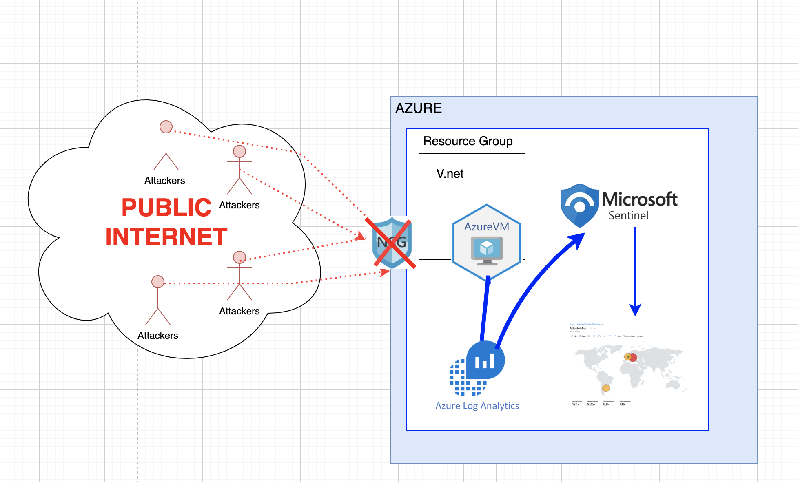
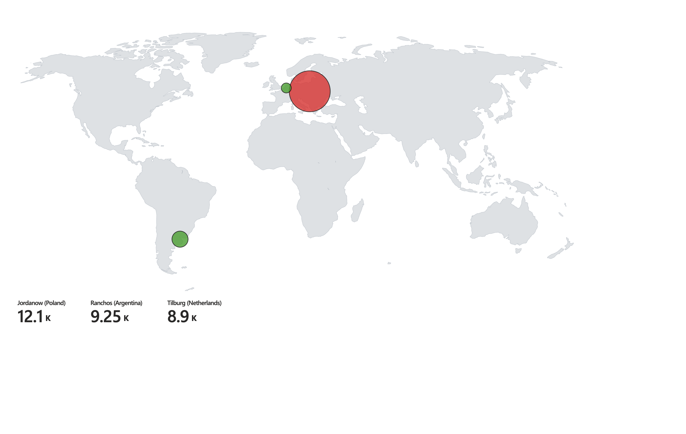
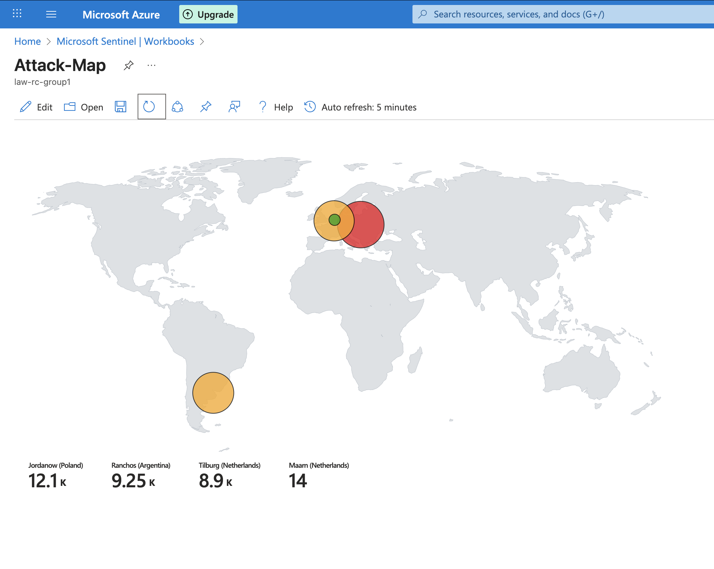
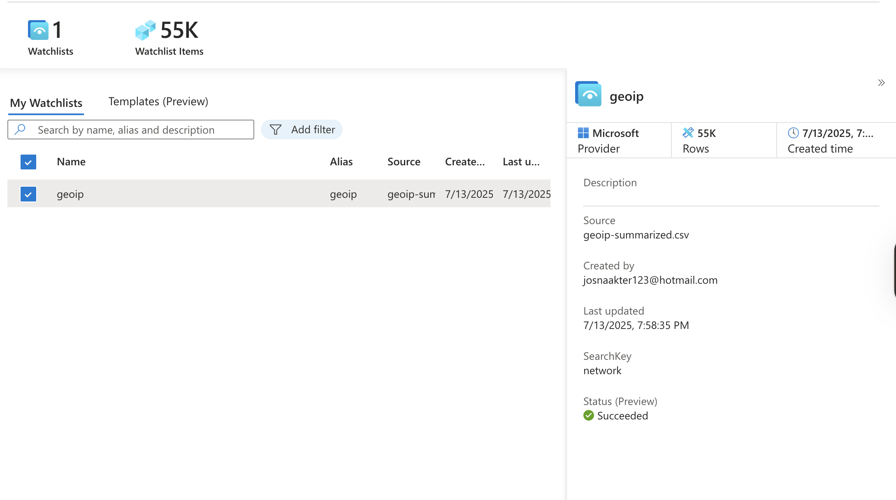

# Cyber Home Lab with Microsoft Sentinel (2025)

This is a hands-on SOC lab built using Microsoft Azure and Microsoft Sentinel to simulate attacker behavior, collect security logs, and detect threats in real time.

## What I Did

- Created an Azure Virtual Machine (Windows 10) as a honeypot  
- Opened inbound traffic and disabled Windows Firewall to attract attacks  
- Simulated failed login attempts (Event ID 4625)  
- Collected logs using Log Analytics Workspace (LAW)  
- Connected Microsoft Sentinel to analyze the logs  
- Queried logs using Kusto Query Language (KQL)  
- Imported a GeoIP watchlist to enrich attacker IPs with location data  
- Built an attack map using Sentinel Workbooks  

## Skills Demonstrated

- SIEM setup (Microsoft Sentinel)  
- Log collection and threat detection  
- KQL querying  
- Log enrichment using Watchlists  
- Azure VM/network configuration  

## Screenshots

Here are some screenshots from the lab:

- **Architecture Overview**:  
    

- **Initial Attack Map**:  
    

- **4-Hour Attack Map**:  
    

- **Microsoft Sentinel Dashboard**:  
    

## Tools Used

- Microsoft Azure  
- Windows 10 VM  
- Log Analytics  
- Microsoft Sentinel  
- Sysmon / Event Viewer  
- KQL  

## Future Improvements

- Integrate Azure Logic Apps to automate responses (e.g., block IPs after repeated failed logins)  
- Use Microsoft Defender for Cloud for real-time threat prevention  
- Simulate more complex attacks and build playbooks to respond automatically  
